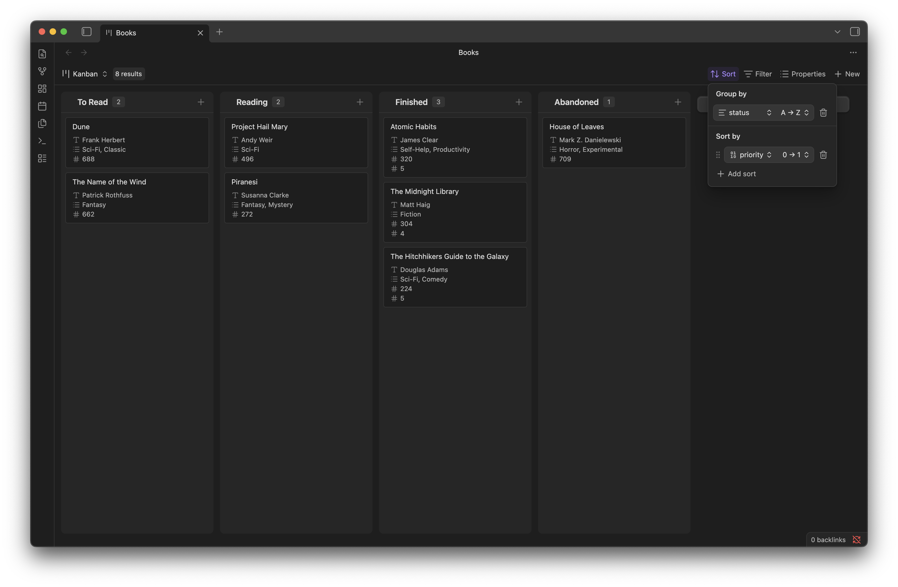

# Bases Kanban

Requires [Obsidian 1.10.6](https://obsidian.md/changelog/2025-11-25-desktop-v1.10.6/). This plugin adds a kanban layout to Obsidian Bases.

## Kanban view for Obsidian Bases

Adds a kanban layout to [Obsidian Bases](https://help.obsidian.md/bases) so you can display notes as cards organized in columns.



## Features

-   **Display notes as cards** grouped by a property value (e.g., status, priority)
-   **Drag and drop cards** between columns to update the groupBy property
-   **Drag and drop columns** to reorder them (order is persisted)
-   **Drag to sort cards** within a column (requires a numeric sort property)
-   **Add new cards** directly from any column
-   **Click cards** to open the corresponding note

## Installation

### For development

1. Clone this repository into your vault's `.obsidian/plugins/` folder
2. Run `npm install`
3. Run `npm run dev` to start development mode
4. Enable the plugin in Obsidian Settings → Community plugins

### Building

```bash
npm run build
```

## Usage

1. Create a Base in Obsidian
2. Switch to Kanban view from the view switcher
3. Use the **Sort menu** to configure:
    - **Group by**: The property that defines columns (e.g., `status`)
    - **Sort by**: Optional numeric property for card ordering within columns (e.g., `order`)

### Drag and Drop

| Action                        | Effect                                               |
| ----------------------------- | ---------------------------------------------------- |
| Drag a card to another column | Updates the card's groupBy property in frontmatter   |
| Drag a card within a column   | Reorders cards (updates sort property if configured) |
| Drag a column header          | Reorders columns (persisted in view config)          |

### Requirements for drag and drop

-   **Moving cards between columns**: The groupBy property must be a frontmatter property (detected automatically from the Bases groupBy setting)
-   **Reordering cards within columns**: Requires a single numeric sort property configured in the Bases Sort menu

## How it works

The plugin uses the Bases framework for data:

-   Column grouping uses the Bases "Group by" setting
-   Card sorting uses the Bases "Sort by" setting
-   Card properties displayed use the Bases "Properties" configuration

When you drag a card to a different column, the plugin updates that note's frontmatter to change the groupBy property value. When you reorder cards within a column, it renumbers all cards with clean integers (1, 2, 3...) respecting ascending/descending sort direction.

## License

MIT
